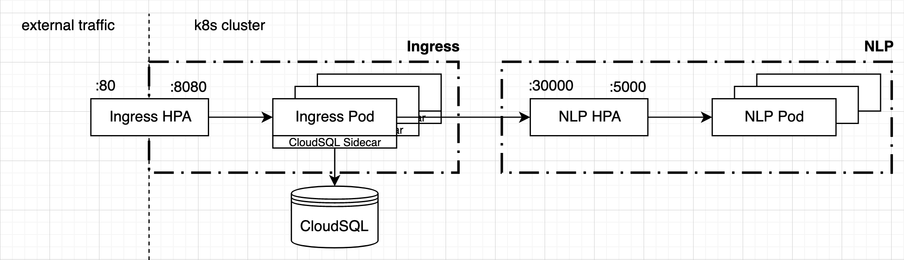

# reflect-nlp

[](https://circleci.com/gh/jackyzha0/reflect-nlp)

The backend of reflect which determines intent validity and does stats collection. <br>
[the main repo.](https://github.com/jackyzha0/reflect-chrome)




Anything related to the ingress controller can be found in `/ingress`. All the NLP stuff can be found in `/nlp`.

### Docker build instructions
1. Build ingress proxy image: `docker build -t jzhao2k19/reflect-nlp-ingress:latest ingress`
2. Build NLP model image: `docker build -t jzhao2k19/reflect-nlp:latest nlp`
3. Push both Docker Images to Docker Hub


### Running the K8s deployment locally
First, ensure you have [Docker Desktop](https://www.docker.com/products/docker-desktop) installed. There are also a few other requirements that you should install as well.

1. VirtualBox
You can get this through homebrew by doing `brew install virtualbox`. VirtualBox allows us to run the VMs.
2. kubectl
Pronounced cube-control, kubectl is the command line interface for talking to K8s. Install it by doing `brew install kubectl`.
3. minikube
minikube allows you to run a K8s cluster right on your laptop! Install it by going `brew install minikube`. <br>

Finally, enable some addons for minikube which allow us to configure the horizontal pod autoscalers (HPAs).
`minikube addons enable heapster`
`minikube addons enable metrics-servce` <br>


To spin up the K8s cluster, start minikube then use kubectl to apply our config. 
`minikube start`
`kubectl apply -f k8s_local.yaml`
To see if this is done successfully, run `kubectl get pods`. It should give you something that looks like the following.

```bash
➜ kubectl get pods
NAME                           READY   STATUS    RESTARTS   AGE
ingress-54f9b89fc4-nxl47       1/1     Running   0          5m
nlp-5f77b4946-vs4l2            1/1     Running   0          5m
```

Wait a few minutes for the LoadBalancer to be assigned an external IP address, then run `kubectl get svc` to list running services.

```bash
➜ kubectl get svc
NAME              TYPE           CLUSTER-IP       EXTERNAL-IP   PORT(S)           AGE
ingress-service   LoadBalancer   10.106.149.250   <pending>     80:31274/TCP      7m
kubernetes        ClusterIP      10.96.0.1        <none>        443/TCP           7m
nlp-service       NodePort       10.103.174.142   <none>        30000:32610/TCP   7m
```

Note that on GKE, the `EXTERNAL-IP` of `ingress-service` would be configured for you. However, if you're developing locally on `minikube`, you can just access the service by doing `minikube service ingress-service`. <br>

You can check to which HPAs are running by doing `kubectl get hpa`.

```bash
➜ kubectl get hpa
NAME      REFERENCE            TARGETS   MINPODS   MAXPODS   REPLICAS   AGE
ingress   Deployment/ingress   0%/80%    1         3         1          9m
nlp       Deployment/nlp       32%/50%   1         10        1          9m
```

To test if everything is healthy, run `minikube service ingress-service` which will open a new browser window. This page should give you a `404` as nothing is listening on `/`. However, if you visit `/healthcheck`, you should see a nice JSON like so:

```json
{
	"proxyAlive": true,
	"modelAlive": true
}
```

### Running the NLP Model
This project depends on a bunch of Python libraries. Install them by doing `pip install sklearn keras pandas numpy matplotlib` <br>

For local development, you can run the server by doing `python server.py`, which will start a local server on port 5000. 

### Training the NLP Model

You can train a new version of the neural network on the `data/survey.csv` data by doing `python train.py`. This will begin training of a basic 64 cell LSTM model (which is defined in `net.py`). You can configure the training parameters which are constants at the top of `train.py`.

```python
TOKENIZER_VOCAB_SIZE = 500 # Vocabulary size of the tokenizer
SEQUENCE_MAX_LENGTH = 75 # Maximum sequence length, all seqs are padded to this
BATCH_SIZE = 128 # number of examples per batch
NUM_EPOCHS = 10 # number of epochs to train for (an epoch is one iteration of the entire dataset)
TRAIN_TEST_SPLIT = 0.1 # percentage of data to use for testing
VALIDATION_SPLIT = 0.1 # percentage of training data to use for validation
```

Trained models are stored in the `models` folder. Each model is under its own folder whose folder structure looks as follows:

```python
models
 | - acc%%.%% # where %%.%% represents accuracy on the test set
 |   | - details.yaml # stores training details
 |   | - model.json # stores model architectures
 |   | - tokenizer.json # stores tokenizer embeddings
 |   | - weights.h5 # stores weights for neural conenctions
 | ...
```

### NLP Model CLI

You can also run the NLP model through the command line (given the model exists) by just providing arguments to `serve_model.py`. Example usage is as follows,

```bash
# e.g.
# serve_model.py -m <nameofmodel> -t <threshold> -i <intent>

python serve_model.py -i "I need to make a marketing post"
# Predicting using model acc81.08 with threshold 0.50 on intent "I need to make a marketing post"
# Output -> True

python serve_model.py -i "I want to browse memes"
# Predicting using model acc81.08 with threshold 0.50 on intent "I want to browse memes"
# Output -> False
```

### Using different NLP models on the server.

Currently, the server is running a default model of the `acc81.08` model. This is defined in `server.py` as follows,

```python
if __name__ == '__main__':
    logging.info("Starting server...")
    m = Model("acc81.08", threshold=0.5)
    app.run()
```

You may change the model name and threshold however you may see fit.

### Data Usage

All data found in `data/survey.csv` collected from [this survey](http://bit.ly/reflectdata) that our team sent out in January of 2020. You may use this data to train your own models.